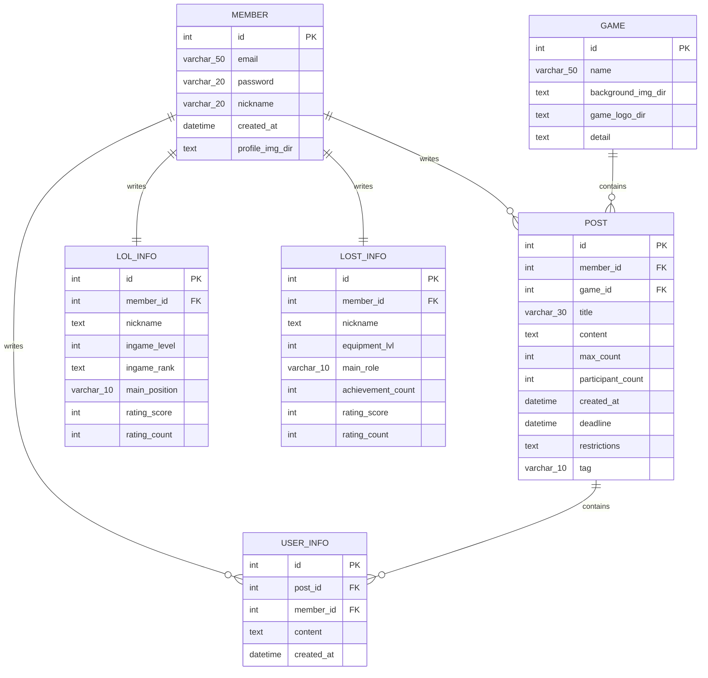

# 1. 데이터베이스 ERD 및 테이블 정의서

## 목차
- [1. 데이터베이스 ERD 및 테이블 정의서](#1-데이터베이스-erd-및-테이블-정의서)
- [1.1 Mermaid 기반 ERD 다이어그램](#11-mermaid-기반-erd-다이어그램)
- [1.2 테이블 상세 명세서](#12-테이블-상세-명세서)
- [1.3 테이블 생성 DDL 스크립트](#13-테이블-생성-ddl-스크립트)

---

## 1.1 Mermaid 기반 ERD 다이어그램



---

## 1.2 테이블 상세 명세서

### 1.2.1 member (회원 테이블)
- id: INT, PRIMARY KEY, AUTO_INCREMENT (회원 고유 식별자)
- email: VARCHAR(50), NOT NULL (이메일 아이디)
- password: VARCHAR(20), NOT NULL (비밀번호)
- nickname: VARCHAR(20), NOT NULL (닉네임)
- created_at: DATETIME, DEFAULT CURRENT_TIMESTAMP (가입 일시)
- profile_img_dir: text (프로필 이미지 경로)

### 1.2.2 post (게시글 테이블)
- id: INT, PRIMARY KEY, AUTO_INCREMENT (게시글 고유 식별자)
- member_id: INT, FOREIGN KEY, NOT NULL (작성자 회원 식별자)
- game_id: INT. FOREIGN KEY, NOT NULL (게임 식별자)
- tag: varchar(10), NOT NULL (카테고리)
- restrictions : text (제한 조건)
- title: VARCHAR(30), NOT NULL (게시글 제목)
- content: TEXT, NOT NULL (게시글 본문)
- max_count: INT, DEFAULT 0 (인원 제한)
- participant_count: INT, DEFAULT 1 (참여 인원)
- created_at: DATETIME, DEFAULT CURRENT_TIMESTAMP (작성 일시)
- deadline : DATETIME, NOT NULL (마감 기한)

### 1.2.3 user_info (가입 유저 테이블)
- id: INT, PRIMARY KEY, AUTO_INCREMENT (가입 유저 고유 식별자)
- post_id: INT, FOREIGN KEY (대상 게시글 식별자)
- member_id: INT, FOREIGN KEY (댓글 작성자 식별자)
- content: TEXT, NOT NULL (댓글 내용)
- created_at: DATETIME, DEFAULT CURRENT_TIMESTAMP (작성 일시)

### 1.2.4 game (게임 테이블)
- id: INT, PRIMARY KEY, AUTO_INCREMENT (게임 고유 식별자)
- name: VARCHAR(50), UQIQUE, NOT NULL (게임 이름)
- background_img_dir : text (배경 이미지 경로)
- game_logo_dir: text (게임 로고 이미지 경로)
- detail: text (게임 상세)

### 1.2.5 lol_info (lol 프로필 정보 테이블)
- id: INT, PRIMARY KEY, AUTO_INCREMENT (lol 테이블 고유 식별자)
- member_id: INT, FOREIGN KEY, NOT NULL (작성자 회원 식별자)
- ingame_nickname: TEXT, NOT NULL (인게임 닉네임)
- ingame_lvl: INT, NOT NULL (인게임 레벨)
- ingame_rank: TEXT, NOT NULL (인게임 랭크)
- main_position: VARCHAR(10), NOT NULL (주 포지션)
- rating_score: INT, NOT NULL (평점)
- rating_count: INT, DEFAULT 0 (평가해준 인원)

### 1.2.6 lost_info (lost ark 프로필 정보 테이블)
- id: INT, PRIMARY KEY, AUTO_INCREMENT (lost 테이블 고유 식별자)
- member_id: INT, FOREIGN KEY, NOT NULL (작성자 회원 식별자)
- ingame_nickname: TEXT, NOT NULL (인게임 닉네임)
- equipment_lvl: INT, NOT NULL (인게임 장비레벨)
- main_role: VARCHAR(10), NOT NULL (주캐릭 직업)
- achievement_count: INT, NOT NULL (업적수)
- rating_score: INT, NOT NULL (평점)
- rating_count: INT, DEFAULT 0 (평가해준 인원)
---

## 1.3 테이블 생성 DDL 스크립트

```sql
CREATE TABLE IF NOT EXISTS member
(
    id              int AUTO_INCREMENT PRIMARY KEY,
    email           VARCHAR(50) NOT NULL,
    pw              VARCHAR(20) NOT NULL,
    name            VARCHAR(20) NOT NULL,
    created_at      DATETIME DEFAULT CURRENT_TIMESTAMP,
    profile_img_dir TEXT
);

CREATE TABLE IF NOT EXISTS post
(
    id                INT AUTO_INCREMENT PRIMARY KEY,
    game_id           INT REFERENCES game (id) ON DELETE CASCADE,
    member_id         INT REFERENCES member (id) ON DELETE RESTRICT,
    tag               VARCHAR(10) NOT NULL,
    restrictions      TEXT,
    title             VARCHAR(30) NOT NULL,
    content           TEXT        NOT NULL,
    max_count         INT      DEFAULT 0,
    participant_count INT      DEFAULT 1,
    deadline          DATETIME    NOT NULL,
    created_at        DATETIME DEFAULT CURRENT_TIMESTAMP
);

CREATE TABLE IF NOT EXISTS USER_INFO (
    id         INT AUTO_INCREMENT PRIMARY KEY,
    member_id  VARCHAR(20) REFERENCES member (id) ON DELETE RESTRICT,
    post_id    INT REFERENCES post (id) ON DELETE CASCADE,
    content    TEXT NOT NULL,
    created_at DATETIME DEFAULT CURRENT_TIMESTAMP
)

CREATE TABLE IF NOT EXISTS game
(
    id                 INT PRIMARY KEY,
    name               VARCHAR(50) UNIQUE NOT NULL,
    background_img_dir TEXT,
    game_logo_dir      TEXT,
    detail             TEXT
)

CREATE TABLE IF NOT EXISTS lol_info
(
    id              INT AUTO_INCREMENT PRIMARY KEY,
    member_id       INT REFERENCES member (id) ON DELETE CASCADE,
    ingame_nickname TEXT        NOT NULL,
    ingame_lvl      INT         NOT NULL,
    ingame_rank     TEXT        NOT NULL,
    main_position   VARCHAR(10) NOT NULL,
    rating_score    INT         NOT NULL,
    rating_count    INT DEFAULT 0
)

CREATE TABLE IF NOT EXISTS lostark_info
(
    id                INT AUTO_INCREMENT PRIMARY KEY,
    member_id         INT REFERENCES member (id) ON DELETE CASCADE,
    ingame_nickname   TEXT        NOT NULL,
    equipment_lvl     INT         NOT NULL,
    main_role         VARCHAR(10) NOT NULL,
    achievement_count INT         NOT NULL,
    rating_score      INT         NOT NULL,
    rating_count      INT DEFAULT 0
)
```
