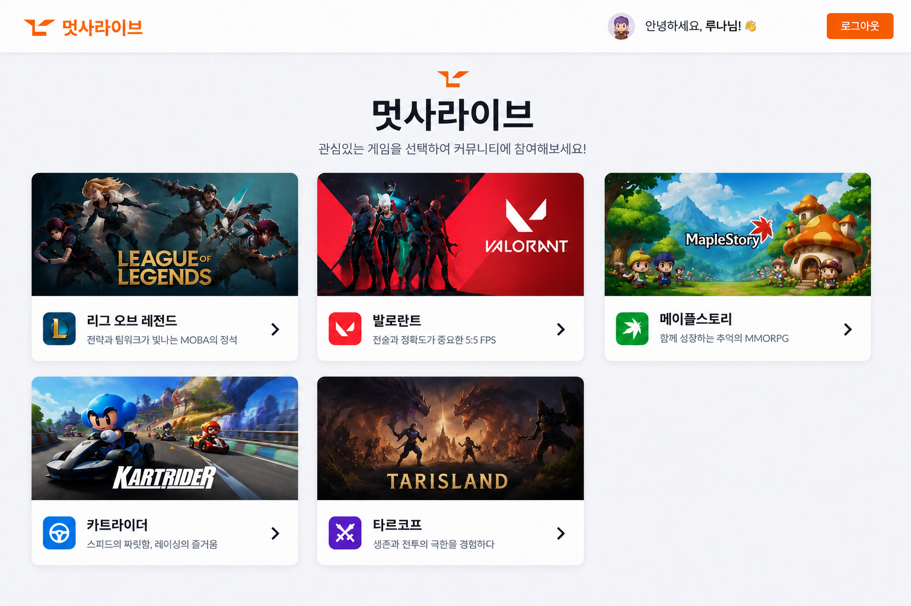
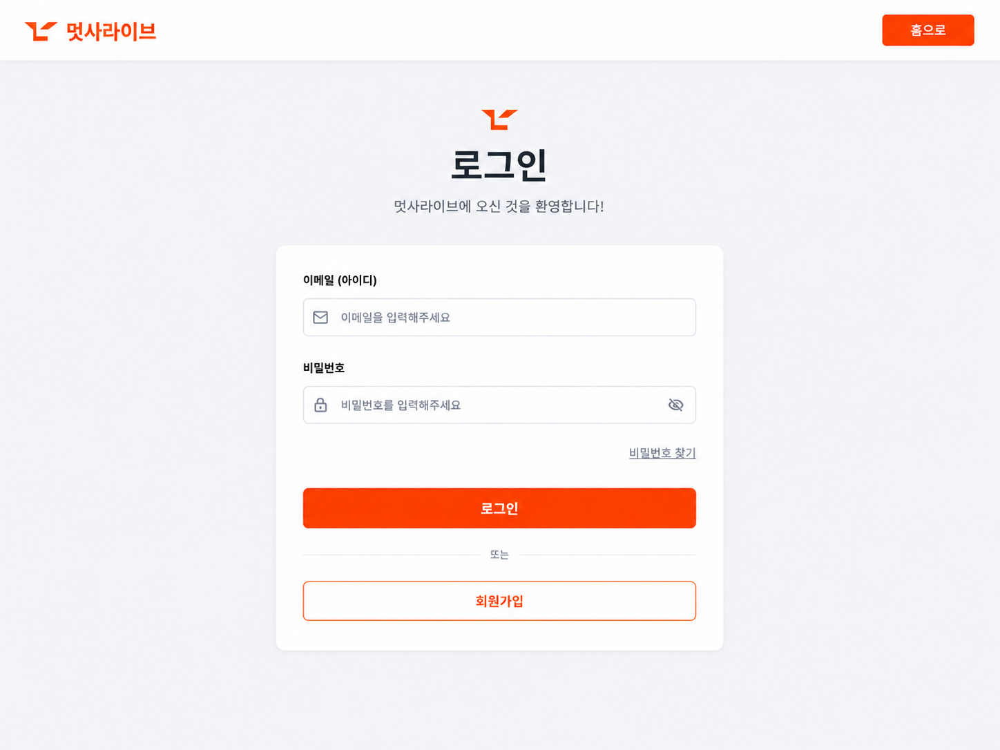
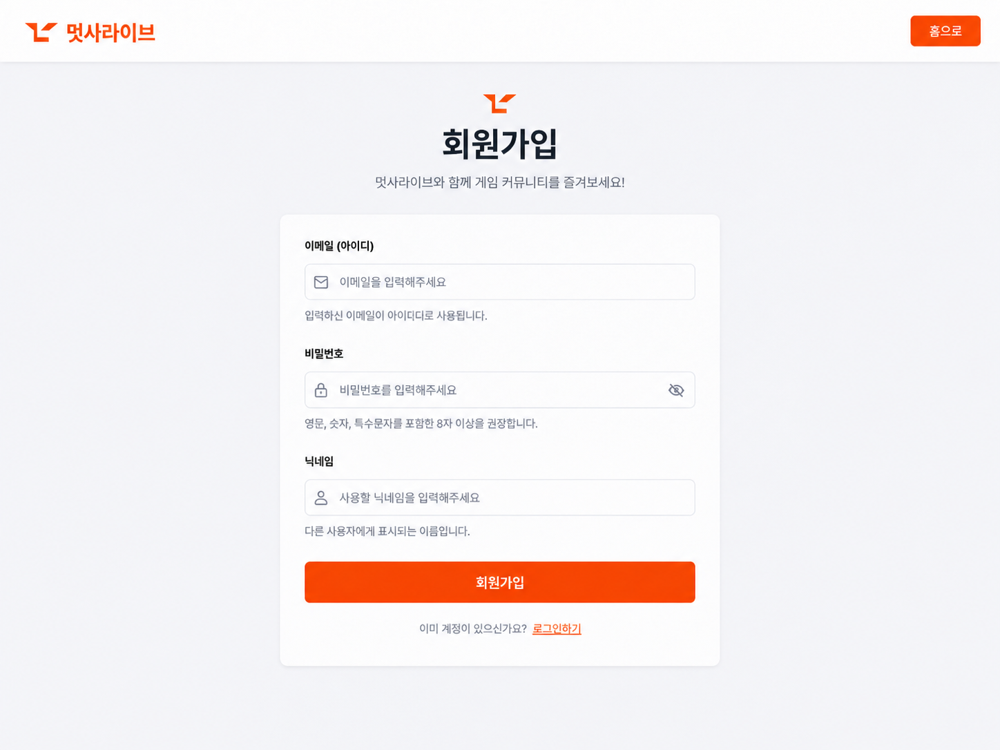
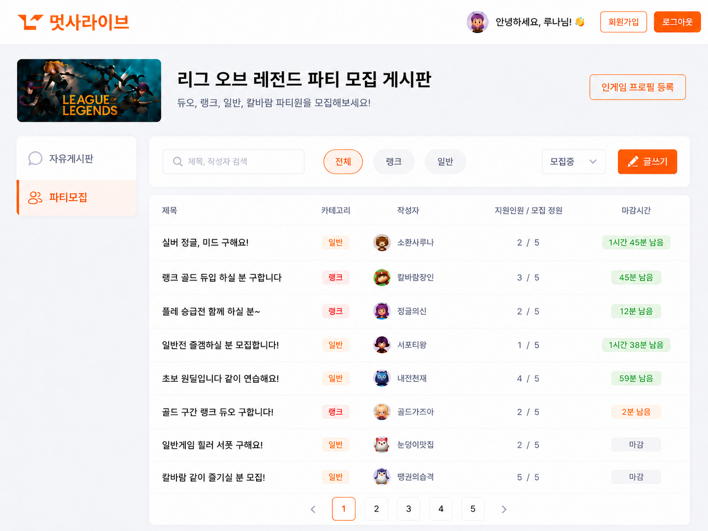
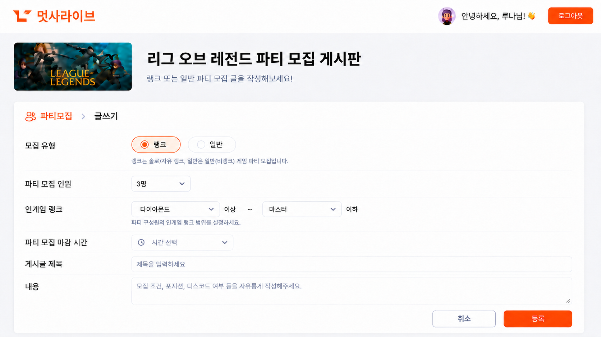
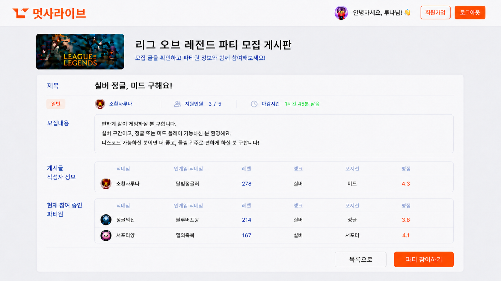
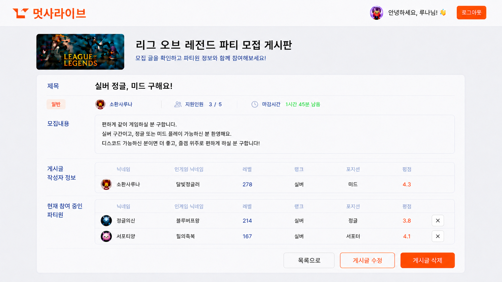
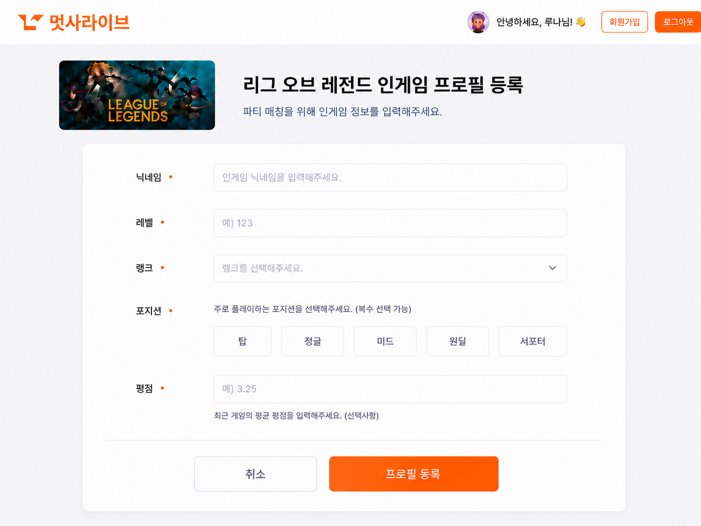

# 화면 설계서 (UI Wireframe)

## 목차
- [1. 서비스 화면 구성 개요](#1-서비스-화면-구성-개요)
- [2. 주요 화면별 명세](#2-주요-화면별-명세)

---

## 1. 서비스 화면 구성 개요

### 1.1 주요 화면 목록
- 메인 화면 
- 로그인 화면 
- 회원가입 화면
- 파티 모집 게시판 목록 
- 파티 모집 상세 조회
- 파티 모집 글 작성
- 파티 모집 글 수정
- 파티 모집 상세 화면(사용자) 
- 파티 모집 상세 화면(작성자)
- 프로필 등록화면 

---

## 2. 주요 화면별 명세

### 2.1 메인 화면 (GET `/main`)

- 출력 데이터 항목 (Output Data):
  - GNB 영역: 멋사라이브 로고, 로그인 버튼  (이미 로그인 상태인 경우 로그아웃 버튼 초기 메인화면으로 이동)
  - 히어로 영역: 메인 카피 ("게이머를 위한 실시간 파티 매칭 서비스")
  - 게임 카테고리 카드 목록 (lol, lost ark)

- 화면 제어 및 권한 규칙 (Behavior Rules):
  - 로그인 버튼 클릭 시 로그인 화면으로 이동
  - 게임 카드 클릭 시 미인증 상태에서도 게시물 페이지에 이동

### 2.2 로그인 화면 (GET `/member/login`)

- 입력 데이터 및 검증 규칙 (Input Data & Validation):
  - 아이디/이메일: 필수 입력
  - 비밀번호: 필수 입력
- 화면 제어 및 권한 규칙 (Behavior Rules):
  - [로그인] 버튼 클릭 시 인증 성공 후 메인 화면 (로그인 후)으로 이동
  - [회원가입] 버튼 클릭 시 회원가입 화면으로 이동
  - 로고 클릭 시 로그인 전 메인 화면으로 이동

### 2.3 회원 가입 화면 (GET `/member/register`)

- 입력 데이터 및 검증 규칙 (Input Data & Validation):
  - 이메일: 필수 입력, 어노테이션 이메일 형식 검증
  - 비밀번호: 필수 입력 항목, 공백 제출 제한, 4~20자 이하 (not blank)
  - 닉네임: 필수 입력 항목, 2~20자 이하
- 화면 제어 및 권한 규칙 (Behavior Rules):
  - [가입하기] 버튼 제출 시 유효성 검증 완료 후 로그인 화면으로 이동

### 2.4 파티 모집 게시판 (GET `/board/{gameId}/`)

- 출력 데이터 항목 (Output Data):
  - GNB 및 헤더: 선택된 게임 배너 타이틀
  - 탭 메뉴: 파티 모집
  - 필터 및 검색: 검색창(제목, 작성자), 검색 필터(랭크, 일반, 모집중), [글쓰기 버튼], [프로필 등록] 버튼
  - 파티 목록 테이블: 제목, 카테고리, 작성자, 지원인원, 모집정원, 마감시간 
- 화면 제어 및 권한 규칙 (Behavior Rules):
  - [글쓰기] 버튼 클릭 시 파티 모집 작성 화면으로 이동
  - [프로필 등록] 버튼 클릭 시 전개글/프로필 등록 화면으로 이동
  - 파티 게시글 행 클릭 시 해당 파티 모집 상세 화면(사용자)으로 이동

### 2.5 파티 모집 작성 화면 (GET `/board/{gameId}/write`)

- 입력 데이터 및 검증 규칙 (Input Data & Validation):
  - 모집 유형: 필수 선택, 체크 박스 (Radio, 랭크 / 일반) 
  - 파티 모집 인원: 필수 선택, selectBox
  - 인게임랭크: 필수 선택, label 2개 (미정)
  - 파티 모집 마감 시간: 필수 선택, selectBox
  - 게시글 제목: 필수 입력 사항
  - 게시글 내용: 필수 입력 사항
- 화면 제어 및 권한 규칙 (Behavior Rules):
  - [취소] 버튼 클릭 시 파티 모집 게시판 목록으로 이동
  - [등록하기] 버튼 제출 시 유효성 검증 수행 후 파티 모집 상세 화면(작성자)으로 이동

### 2.6 파티 모집 상세 화면(사용자) (GET `/board/{gameId}/detail?id={postId}`)

- 출력 데이터 항목 (Output Data):
  - GNB 및 타이틀 영역: 서비스 로고, 사용자 프로필/인증 정보, 게임별 게시판 헤더 배너 (ex: 리그 오브 레전드 파티 모집 게시판)
  - 게시글 헤더 정보: 게시글 제목, 작성자 정보, 참여 인원 현황, 마감 시간
  - 본문 내용: 상세 소개글
  - 게시글 작성자 프로필 정보: (인게임 닉네임, 레벨, 랭크 포지션, 평점 등) 
  - 현재 참여 중인 파티원 정보:  (인게임 닉네임, 레벨, 랭크 포지션, 평점 등)
  - 하단 버튼: [목록으로], [파티 참여 신청]
- 화면 제어 및 권한 규칙 (Behavior Rules):
  - [파티 참여하기] 버튼 클릭시 참여 신청 처리, 상세 참여 게시판으로 이동
  - 목록 이동: [목록으로] 버튼 클릭 시 이전 파티 모집 게시판 목록 화면으로 이동
  - 권한 제어: 일반 방문/참여자 시점 화면이므로 게시글 수정/삭제/모집완료 컨트롤은 숨김 처리되며, [파티 참여하기] 버튼이 노출됨

### 2.7 파티 모집 상세 화면(작성자) (GET `/board/{gameId}/detail?id={postId}`)

- 출력 데이터 항목 (Output Data):
  - 일반 사용자 화면 데이터 + 관리 컨트롤 영역
- 화면 제어 및 권한 규칙 (Behavior Rules):
  - [수정] 버튼 클릭 시 파티 모집 작성 화면으로 이동하며 글쓰기 -> 수정으로 변경
  - 파티원 [X] 클릭시 참여인원에서 삭제
  - [게시글 삭제] 클릭 시 파티 모집 게시판으로 이동, 게시글 리스트에서 제거
  - [게시글 목록] 클릭 시 파티 모집 게시판으로 이동, 게시글 리스트에 보임

### 2.8 프로필 등록화면 (게임마다 변경사항 있음) (GET `/board/{gameId}/profile`)

- 출력 데이터 항목 (Output Data):
  - GNB 및 타이틀 영역: 서비스 로고, 사용자 프로필/인증 정보, 게임별 게시판 헤더 배너
  - 입력 폼 타이틀: 닉네임, 레벨, 랭크, 포지션 등 
- 입력 데이터 및 검증 규칙 (Input Data & Validation):
  - 닉네임: 필수 입력
  - 레벨: 필수 입력
  - 랭크: 필수 선택(Raid)
  - 포지션: 필수 선택
- 화면 제어 및 권한 규칙 (Behavior Rules):
  - 권한: 로그인 인증 세션 존재 시에만 접근 허용
  - 포지션 복수 선택: 포지션 버튼은 클릭 시 토글(활성화/비활성화) 방식으로 동작하며, 최소 하나 이상 선택되어야 함 (유효성 검증)
  - [취소] 버튼 클릭 시 이전 화면(예: 게시판 목록)으로 이동
  - [프로필 등록] 버튼 제출 시 필수 항목에 대한 'not blank' (공백 제출 제한) 유효성 검증 수행 후, 성공 시 프로필 등록 처리 및 게시판 목록 화면으로 이동.
---

## 3. 전체 화면 와이어프레임 배치도
- [와이어프레임 통합 파일 링크](https://www.tldraw.com/f/bIj1otV_QRhwpwpX1GlZr?d=v-2084.-578.8023.2906.7eeMwtUmA4YB-RvRAtNUA)

